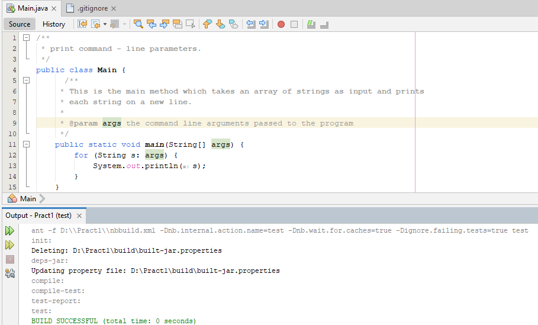

# 35_svyanrenko_anatolii
----
+ [TASK01](#TASK01)

----

## TASK01:

Завдання:

Выполнить разработку простейшей консольной программы на Java, например, выводящей на экран все аргументы командной строки, заданные при запуске и разместить её в локальном хранилище.

# 1. Код програми:
 ``` java
/**
 * print command - line parameters.
 */
public class Main {
      /**
     * This is the main method which takes an array of strings as input and prints
     * each string on a new line.
     *
     * @param args the command line arguments passed to the program
     */
    public static void main(String[] args) {
        for (String s: args) {
            System.out.println(s);
        }
    }
}
    ```
    
# 2. Скріншот роботи програми:


----
