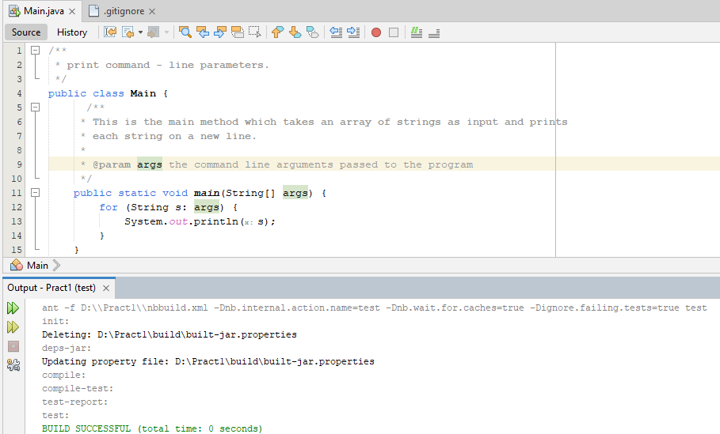
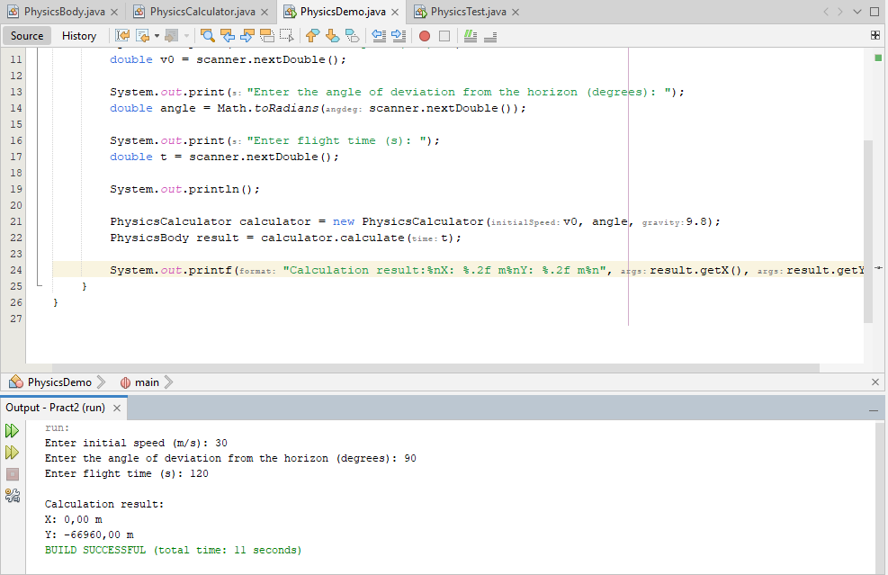
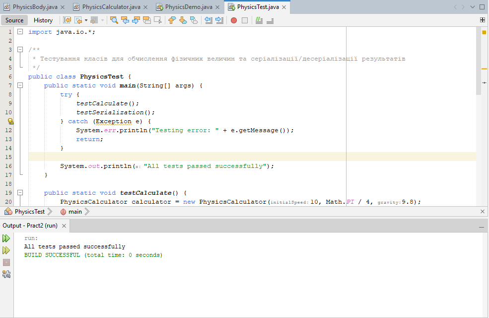
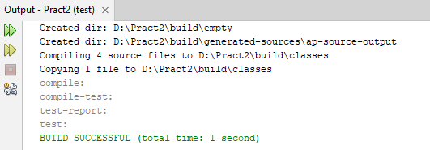

# 35_svyanrenko_anatolii
----
+ [TASK01](#TASK01)
+ [TASK02](#TASK02)
----

## TASK01:

Завдання:

Выполнить разработку простейшей консольной программы на Java, например, выводящей на экран все аргументы командной строки, заданные при запуске и разместить её в локальном хранилище.

# 1. Код програми:
 ``` java
/**
 * print command - line parameters.
 */
public class Main {
      /**
     * This is the main method which takes an array of strings as input and prints
     * each string on a new line.
     *
     * @param args the command line arguments passed to the program
     */
    public static void main(String[] args) {
        for (String s: args) {
            System.out.println(s);
        }
    }
}
```

# 2. Скріншот роботи програми:


----

## TASK02:

Завдання:

Определить 16-ричное представление целочисленных значений координат (x = v0 * cos(α) * t; y = v0 * sin(α) * t - (g * t * t) / 2) положения физического тела при движении под действием силы тяжести.

Виконання:

1. Розробив клас, що серіалізується, для зберігання параметрів і результатів обчислень.

# 1. Код PhysicsBody:
 ``` java
import java.io.Serializable;

/**
 * Клас, що представляє фізичне тіло
 */
public class PhysicsBody implements Serializable {
    private double x;
    private double y;

    /**
     * Конструктор, який приймає координати тіла
     * @param x Координата по осі X
     * @param y Координата по осі Y
     */
    public PhysicsBody(double x, double y) {
        this.x = x;
        this.y = y;
    }

    /**
     * Метод для отримання координати по осі X
     * @return Координата по осі X
     */
    public double getX() {
        return x;
    }

    /**
     * Метод для отримання координати по осі Y
     * @return Координата по осі Y
     */
    public double getY() {
        return y;
    }
}
```

2. Використовуючи агрегування, розробив клас для знаходження рішення задачі.

# 2. Код PhysicsCalculator:
 ``` java
import java.io.Serializable;

/**
 * Клас для обчислення параметрів фізичного тіла
 */
public class PhysicsCalculator implements Serializable {
    private double initialSpeed;
    private double angle;
    private double gravity;

    /**
     * Конструктор, який приймає параметри фізичного тіла
     * @param initialSpeed Початкова швидкість
     * @param angle Кут відносно горизонталі
     * @param gravity Прискорення вільного падіння
     */
    public PhysicsCalculator(double initialSpeed, double angle, double gravity) {
        this.initialSpeed = initialSpeed;
        this.angle = angle;
        this.gravity = gravity;
    }

    /**
     * Метод для обчислення параметрів фізичного тіла
     * @param time Час руху тіла
     * @return Об'єкт фізичного тіла
     */
    public PhysicsBody calculate(double time) {
        double x = initialSpeed * Math.cos(angle) * time;
        double y = initialSpeed * Math.sin(angle) * time - 0.5 * gravity * Math.pow(time, 2);
        return new PhysicsBody(x, y);
    }
}
```

3. Розробив клас для демонстрації в діалоговому режимі збереження та відновлення стану об'єкта, використовуючи серіалізацію.

# 3. Код PhysicsDemo:
 ``` java
import java.util.Scanner;

/**
 * Демонстрація використання класів для обчислення фізичних величин
 */
public class PhysicsDemo {
    public static void main(String[] args) {
        Scanner scanner = new Scanner(System.in);

        System.out.print("Enter initial speed (m/s): ");
        double v0 = scanner.nextDouble();

        System.out.print("Enter the angle of deviation from the horizon (degrees): ");
        double angle = Math.toRadians(scanner.nextDouble());

        System.out.print("Enter flight time (s): ");
        double t = scanner.nextDouble();

        System.out.println();

        PhysicsCalculator calculator = new PhysicsCalculator(v0, angle, 9.8);
        PhysicsBody result = calculator.calculate(t);

        System.out.printf("Calculation result:%nX: %.2f m%nY: %.2f m%n", result.getX(), result.getY());
    }
}
```

# Скрін роботи коду:


4. Розробив клас для тестування коректності результатів обчислень та серіалізації/десеріалізації.

# 4. Код PhysicsTest:
 ``` java
import java.io.*;

/**
 * Тестування класів для обчислення фізичних величин та серіалізації/десеріалізації результатів
 */
public class PhysicsTest {
    public static void main(String[] args) {
        try {
            testCalculate();
            testSerialization();
        } catch (Exception e) {
            System.err.println("Testing error: " + e.getMessage());
            return;
        }

        System.out.println("All tests passed successfully");
    }

    public static void testCalculate() {
        PhysicsCalculator calculator = new PhysicsCalculator(10, Math.PI / 4, 9.8);
        PhysicsBody result = calculator.calculate(2.5);

        double expectedX = 10 * Math.cos(Math.PI / 4) * 2.5;
        double expectedY = 10 * Math.sin(Math.PI / 4) * 2.5 - 0.5 * 9.8 * Math.pow(2.5, 2);

        if (Math.abs(result.getX() - expectedX) > 0.0001 || Math.abs(result.getY() - expectedY) > 0.0001) {
            throw new AssertionError("Unexpected result for X or Y coordinate");
        }
    }

    public static void testSerialization() throws IOException, ClassNotFoundException {
        PhysicsBody result = new PhysicsBody(10, 2);

        ByteArrayOutputStream buffer = new ByteArrayOutputStream();
        ObjectOutputStream out = new ObjectOutputStream(buffer);
        out.writeObject(result);

        ObjectInputStream in = new ObjectInputStream(new ByteArrayInputStream(buffer.toByteArray()));
        PhysicsBody restoredResult = (PhysicsBody) in.readObject();

        if (result.getX() != restoredResult.getX() || result.getY() != restoredResult.getY()) {
            throw new AssertionError("Unexpected deserialized result");
        }
    }
}
```

# Скрін роботи коду:


**P.S.** Для написання коду я імпортував стандартні бібліотеки Java, такі як:
    * **```java.io``` - містить класи для роботи з веденням/виведенням даних в програмі**;
    * **```java.io.Serializable``` - використав даний інтерфейс для можливості серіалізації об'єктів класу ```PhysicsBody```**;
    * **```java.util.Scanner``` - використав його для зчитування користувацького вводу з консолі.**;

# Скрін роботи готового продукту:


----