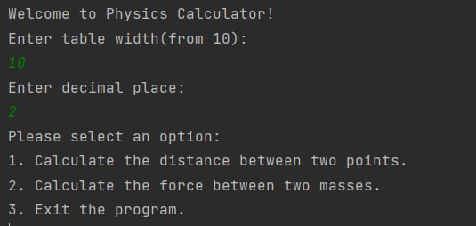

# 35_svynarenko_anatolii
----
+ [TASK01](#TASK01)
+ [TASK02](#TASK02)
+ [TASK03](#TASK03)
+ [TASK04](#TASK04)
----

## TASK01:

Завдання:

Выполнить разработку простейшей консольной программы на Java, например, выводящей на экран все аргументы командной строки, заданные при запуске и разместить её в локальном хранилище.

# 1. Скріншот роботи програми:


----

## TASK02:

Завдання:

Определить 16-ричное представление целочисленных значений координат (x = v0 * cos(α) * t; y = v0 * sin(α) * t - (g * t * t) / 2) положения физического тела при движении под действием силы тяжести.

# 1.  Скрін роботи PhysicsDemo:


# 2. Скрін роботи PhysicsTest:


**P.S.** Для написання коду я імпортував стандартні бібліотеки Java, такі як:
    * **```java.io``` - містить класи для роботи з веденням/виведенням даних в програмі**;
    * **```java.io.Serializable``` - використав даний інтерфейс для можливості серіалізації об'єктів класу ```PhysicsBody```**;
    * **```java.util.Scanner``` - використав його для зчитування користувацького вводу з консолі.**;

----

## TASK03:

Завдання:

1. Як основа використовувати вихідний текст проекту попередньої лабораторної роботи. Забезпечити розміщення результатів обчислень уколекції з можливістю збереження/відновлення.

2. Використовуючи шаблон проектування Factory Method (Virtual Constructor), розробити ієрархію, що передбачає розширення рахунок додавання нових відображуваних класів.

3. Розширити ієрархію інтерфейсом "фабрикованих" об'єктів, що представляє набір методів для відображення результатів обчислень.

4. Реалізувати ці методи виведення результатів у текстовому виде.

5. Розробити тареалізувати інтерфейс для "фабрикуючого" методу.

# 1. Результат виконання завдання:


----

## TASK04:

Завдання:

1.За основу використовувати вихідний текст проекту попередньої лабораторної роботи Використовуючи шаблон проектування Factory Method (Virtual Constructor), розширити ієрархію похідними класами, реалізують методи для подання результатів у вигляді текстової таблиці. Параметри відображення таблиці мають визначатися користувачем.

2.Продемонструвати заміщення (перевизначення, overriding), поєднання (перевантаження, overloading), динамічне призначення методів (Пізнє зв'язування, поліморфізм, dynamic method dispatch).

3. Забезпечити діалоговий інтерфейс із користувачем.

4. Розробити клас для тестування основної функціональності.

5. Використати коментарі для автоматичної генерації документації засобами javadoc.

# 1. Результат виконання завдання:




----